# Chapter 1
ผู้เขียนได้ทำคลิปสรุปเนื้อหาบทที่ 1 
เพื่อปูพื้นฐานสำหรับคนไม่มีความรู้เรื่องคอมพิวเตอร์เลย 

[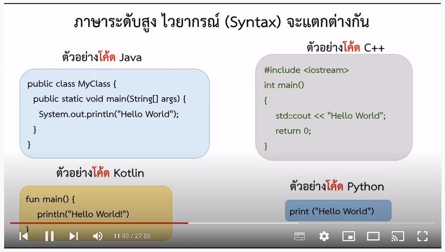](https://youtu.be/8X1sf5BvK0o?list=PL3-rZgmhkOFcP2hzubPEflkfFjTKWwUA-)

# Chapter 2
เนื่องจากผู้เขียนเข้าใจดีว่าเริ่มต้นการเขียนโปรแกรมมันยาก
ก็เลยทำคลิปประกอบบทที่ 2 จะได้เข้าใจพื้นฐานก่อนไปหัดเขียนไพทอน ในบทถัดไปต่อจากนี้

[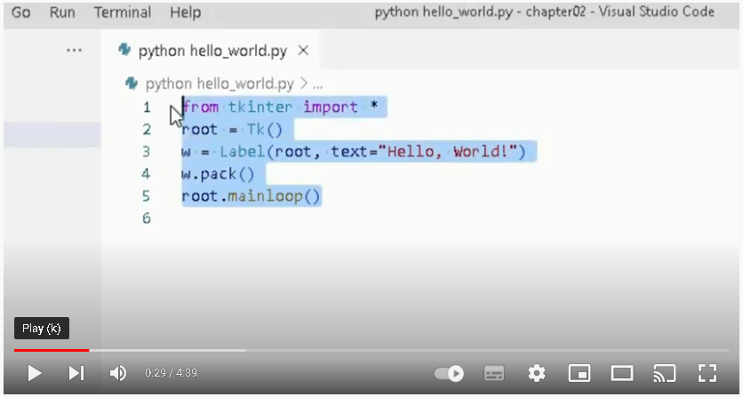](https://youtu.be/7vp0qWJb9fY)

# Chapter 3
เนื่องจากการดีบั๊กสำคัญมากในการเขียนโปรแกรม
ผู้เขียนเลยทำคลิปประกอบของบทที่ 3

[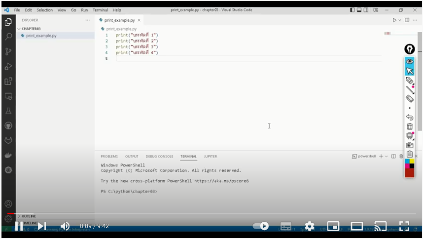](https://youtu.be/8hVPM3PmC2s)

# Chapter 5
ผู้เขียนได้ทำคลิปสอนการดีบั๊ก เพื่อไล่ดูเส้นทางการทำงานของโปรแกรมว่า 
แต่ละสเต็ปของการทำงาน ตัวแปรมันเก็บค่าอะไรบ้าง 

[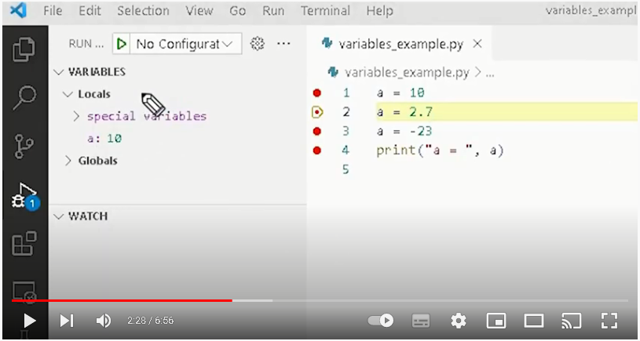](https://youtu.be/BwVzqVx4CBY)

# Chapter 7
ผู้เขียนได้ทำคลิปสอนการดีบั๊ก แล้วทำการ “Add to Watch” เพื่อดูว่านิพจน์มันประมวลผลได้อะไร

[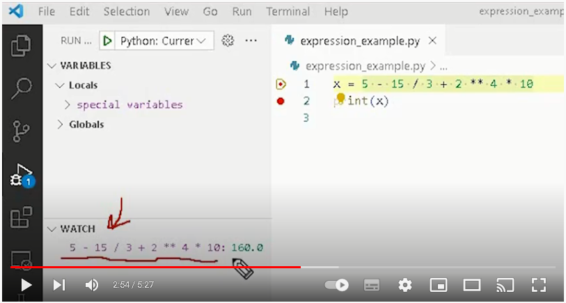](https://youtu.be/oS3Iekm7kBE)

# Chapter 8
ผู้เขียนได้ทำคลิปสอน เพื่อไล่ดีบั๊กดูการทำงานของฟังก์ชัน input 

[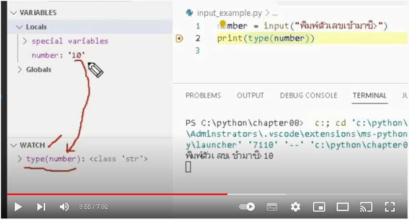](https://youtu.be/aQKB35WCj_E)

# Chapter 9
ผู้เขียนได้ทำคลิปสอน เพื่อไล่ดีบั๊กดูการทำงานของฟังก์ชันที่เราประกาศขึ้นมาเอง 

[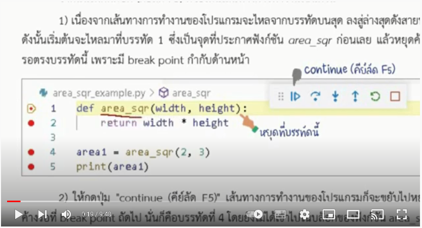](https://youtu.be/LhBHvv8Bwok)

# Chapter 12
ผู้เขียนได้ทำคลิปสอน เพื่อไล่ดีบั๊กดูการทำงานของประโยคคำสั่งรูปแบบ ตระกูล if

[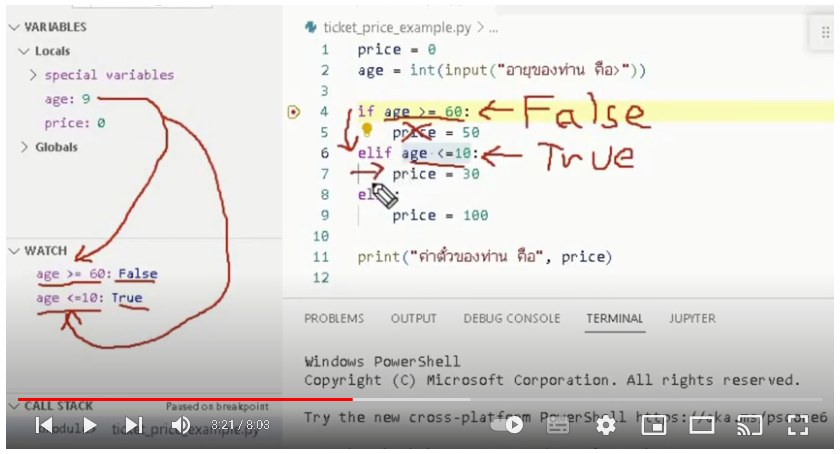](https://youtu.be/Rvncbei1TFo)
# Chapter 13
ผู้เขียนได้ทำคลิปสอน เพื่อไล่ดีบั๊กดูการทำงานของประโยคคำสั่งรูปแบบ while

[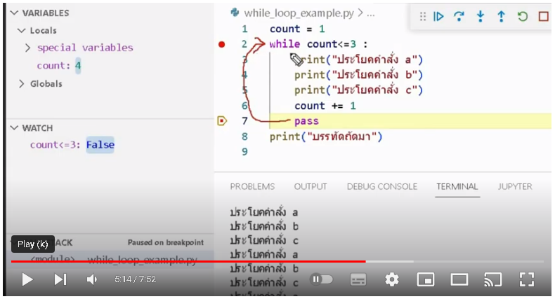](https://youtu.be/Abd7V_ykSzQ)
# Chapter 14
ผู้เขียนได้ทำคลิปสอน เพื่อไล่ดีบั๊กดูการทำงานของประโยคคำสั่งรูปแบบ for

[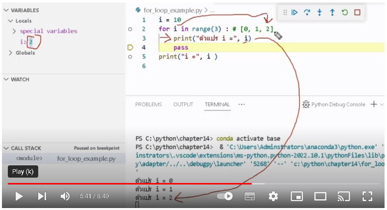](https://youtu.be/bfEx3uU7y8k)
# Chapter 15
<!-กำลังสร้าง->
# Chapter 16
<!-กำลังสร้าง->
# Chapter 17
<!-กำลังสร้าง->
# Install VS Code
ผู้เขียนได้ทำคลิปสรุปวิธีติดตั้งเครื่องมือ ได้แก่ Anaconda และ Visual Studio Code

[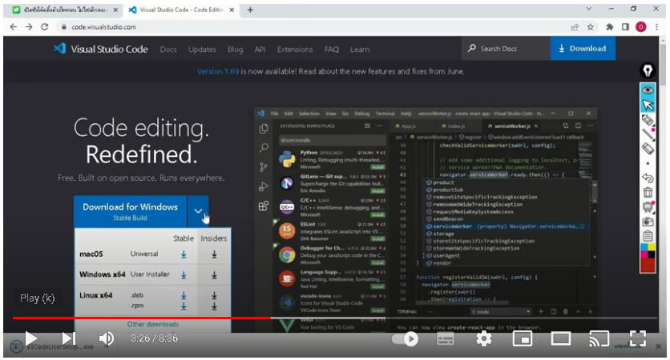](https://youtu.be/ba-vGS8G_Ig)
# Set path
<!-กำลังสร้าง->

# รีวิวหนังสือ
[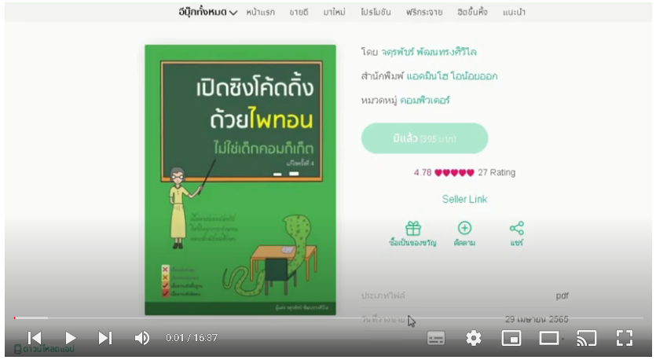](https://youtu.be/9gDnbUo9n7U)
